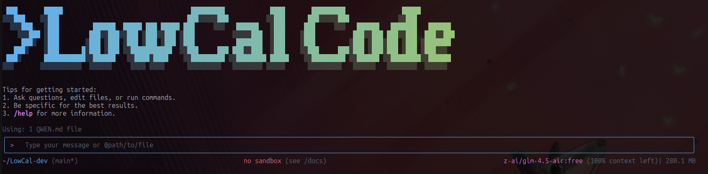

# LowCal Code

<div align="center">



**AI-powered command-line workflow tool for developers**

[Installation](#installation) • [Quick Start](#quick-start) • [Features](#key-features) • [Documentation](./docs/) • [Contributing](./CONTRIBUTING.md)

</div>

LowCal is a powerful command-line AI workflow tool adapted from Qwen Code, specifically optimized for local use with LM Studio and cloud models with OpenRouter. It enhances your development workflow with advanced code understanding, automated tasks, and intelligent assistance.

#### Session Commands

- **`/compress`** - Compress conversation history to continue within token limits
- **`/clear`** - Clear all conversation history and start fresh
- **`/stats`** - Check current token usage and limits

> 📝 **Note**: Session token limit applies to a single conversation, not cumulative API calls.

### 🔍 Explore Codebases

```bash
cd your-project/
LowCal

# Architecture analysis
> Describe the main pieces of this system's architecture
> What are the key dependencies and how do they interact?
> Find all API endpoints and their authentication methods
```

### 💻 Code Development

```bash
# Refactoring
> Refactor this function to improve readability and performance
> Convert this class to use dependency injection
> Split this large module into smaller, focused components

# Code generation
> Create a REST API endpoint for user management
> Generate unit tests for the authentication module
> Add error handling to all database operations
```

### 🔄 Automate Workflows

```bash
# Git automation
> Analyze git commits from the last 7 days, grouped by feature
> Create a changelog from recent commits
> Find all TODO comments and create GitHub issues

# File operations
> Convert all images in this directory to PNG format
> Rename all test files to follow the *.test.ts pattern
> Find and remove all console.log statements
```

### 🐛 Debugging & Analysis

```bash
# Performance analysis
> Identify performance bottlenecks in this React component
> Find all N+1 query problems in the codebase

# Security audit
> Check for potential SQL injection vulnerabilities
> Find all hardcoded credentials or API keys
```

## Popular Tasks

### 📚 Understand New Codebases

```text
> What are the core business logic components?
> What security mechanisms are in place?
> How does the data flow through the system?
> What are the main design patterns used?
> Generate a dependency graph for this module
```

### 🔨 Code Refactoring & Optimization

```text
> What parts of this module can be optimized?
> Help me refactor this class to follow SOLID principles
> Add proper error handling and logging
> Convert callbacks to async/await pattern
> Implement caching for expensive operations
```

### 📝 Documentation & Testing

```text
> Generate comprehensive JSDoc comments for all public APIs
> Write unit tests with edge cases for this component
> Create API documentation in OpenAPI format
> Add inline comments explaining complex algorithms
> Generate a README for this module
```

### 🚀 Development Acceleration

```text
> Set up a new Express server with authentication
> Create a React component with TypeScript and tests
> Implement a rate limiter middleware
> Add database migrations for new schema
> Configure CI/CD pipeline for this project
```

## Commands & Shortcuts

### Session Commands

- `/help` - Display available commands
- `/clear` - Clear conversation history
- `/compress` - Compress history to save tokens
- `/stats` - Show current session information
- `/exit` or `/quit` - Exit LowCal Code

### Keyboard Shortcuts

- `Ctrl+C` - Cancel current operation
- `Ctrl+D` - Exit (on empty line)
- `Up/Down` - Navigate command history

## License

[LICENSE](./LICENSE)
