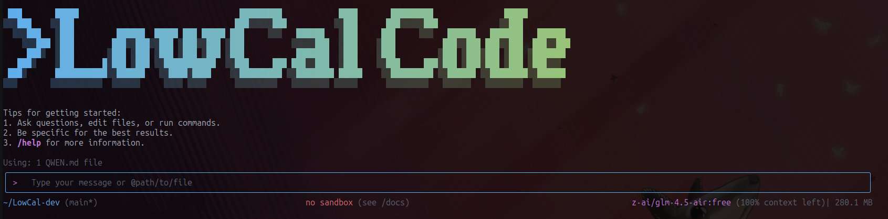

# LowCal Code

<div align="center">



**AI-powered command-line workflow tool for developers**

</div>

LowCal is a powerful command-line AI workflow tool adapted from Qwen Code, specifically optimized for local use with LM Studio and cloud models with OpenRouter. It enhances your development workflow with advanced code understanding, automated tasks, intelligent subagents, and comprehensive scheduling capabilities.

## Features

### 🤖 Advanced AI Capabilities

- **Subagents**: Specialized AI assistants for focused tasks with custom prompts and tool access
- **Custom Prompts**: Create and manage system prompts tailored to specific workflows
- **Model Selection**: Support for LM Studio, OpenRouter, OpenAI, and other OpenAI-compatible providers

### ⚡ Task Automation & Scheduling

- **Scheduler**: Cron-based job scheduling for recurring tasks (tests, builds, reports)
- **Orchestrator**: Automated session management with health monitoring and recovery
- **Dashboard**: Unified view of all sessions, jobs, and daemon status
- **Background Tasks**: Launch parallel tasks with `launch_task` for concurrent work
- **Task Templates**: Reusable task library with per-task auth/model/runtime overrides

### 📁 File & Code Management

- **Multi-file Operations**: Read and process multiple files at once
- **Fast Search**: RipGrep integration for rapid code search
- **Glob Patterns**: Find files using glob patterns
- **Diff Editing**: In-place file modifications with diff preview

### 🔌 Extensibility

- **MCP Servers**: Connect to Model Context Protocol servers for external tools
- **Extensions**: Installable packages that add new capabilities
- **Custom Commands**: Save and reuse favorite prompts as personal shortcuts

### 🛡️ Safety & Control

- **Approval Modes**: Choose between `ask`, `yolo`, or `plan` modes
- **Sandboxing**: Isolated execution environment for security
- **Confirmation Prompts**: Review destructive operations before execution

## Installation

Instructions:

Node and git required. Tested on Linux, WSL2, and MacOS, Windows may not be fully compatible.

```bash
git clone https://github.com/dkowitz/LowCal-Code
cd LowCal-Code
npm install
npm install -g .

Run from anywhere with:

lowcal
```

Or:

```bash
git clone https://github.com/dkowitz/LowCal-Code
cd LowCal-Code
npm build
npm bundle
npm start

To run from a different directory:
cd /path/to/directory
node ~/LowCal-Code/bundle/gemini.ts (replace ~/LowCal-Code with installation directory if different)
```

For LM Studio: Make sure LM Studio is running with the server enabled.

For OpenRouter: An OpenRouter api key is required.

For WebSearch: A Tavily api key is required. Highly recommend a free api key, which gets 1,000 api calls per month.
Add `"tavilyApiKey": "your-key-here"` to your `~/.qwen/settings.json`.

## CLI Commands

LowCal Code provides both in-session commands (slash commands) and terminal-level commands for system management.

### In-Session Commands (`/` prefix)

| Command                                              | Description                                             |
| ---------------------------------------------------- | ------------------------------------------------------- |
| `/help`                                              | Display available commands                              |
| `/clear`                                             | Clear conversation history                              |
| `/summary`                                           | Generate project summary from conversation              |
| `/compress`                                          | Compress history to save tokens                         |
| `/chat save/resume/list/delete <tag>`                | Save and resume conversations                           |
| `/model`                                             | Select a model                                          |
| `/tasks [open/list/run/schedule]`                    | Open task template editor, manage templates, and deploy |
| `/agents create/manage`                              | Manage subagents                                        |
| `/tools [desc/nodesc]`                               | List available tools                                    |
| `/prompt list/show/create/delete/activate/disable`   | Manage custom prompts                                   |
| `/promptmode set <full/concise/auto>`                | Set system prompt mode                                  |
| `/approval-mode <ask/yolo/plan> [--project\|--user]` | Set approval mode                                       |
| `/directory add/remove/list`                         | Manage workspace directories                            |
| `/init`                                              | Generate LOWCAL.md project summary                      |
| `/bug`                                               | File an issue about LowCal Code                         |

### Terminal Commands

| Command                                                                   | Description                                         |
| ------------------------------------------------------------------------- | --------------------------------------------------- |
| `lowcal dashboard [options]`                                              | View all sessions and jobs in a unified interface   |
| `lowcal sessions list/get/prune [options]`                                | Manage active sessions                              |
| `lowcal scheduler <start/stop/status/list/get/mode/delete/reset/logs>`    | Manage scheduler daemon and inspect/maintain jobs   |
| `lowcal tasks <open/list/run/schedule>`                                   | Manage and deploy task templates from terminal mode |
| `lowcal orchestrator <start/stop/status>`                                 | Manage the orchestrator daemon                      |
| `lowcal extensions <install/uninstall/list/update/disable/enable> <name>` | Manage extensions                                   |
| `lowcal mcp <add/remove/list>`                                            | Manage MCP servers                                  |
| `lowcal research [mode] <query>`                                          | Conduct deep internet research                      |

## Session Commands

### YOLO Mode

- **`Ctrl+Y`** - Toggle YOLO mode (execute without confirmation prompts)

### Conversation Management

- **`/compress`** - Compress conversation history to continue within token limits
- **`/clear`** - Clear all conversation history and start fresh
- **`/summary`** - Generate a comprehensive project summary from the current conversation

### Custom Prompts & Toolsets

- **`/promptmode set <full/concise/auto>`**
  - `full`: full, long system prompt with verbose instructions and lots of examples
  - `concise`: short, abbreviated prompt for conserving context space and decreasing latency, particularly for local models. Dynamically constructed to only include instructions/examples for tools from the currently activated toolset.
  - `auto`: automatically uses concise prompt when using LM Studio endpoint and full prompt when using OpenRouter endpoint

- **`/prompt <list/show/create/delete/[use/activate/set]/disable> [--exclusive]`** - Create, manage, and use custom prompts
  - `list`: list available prompts
  - `show [name]`: show the text of a prompt in a viewer (same as `/view` or `/promptinfo`)
  - `create [name] [string or .md file]`: create a new prompt with the given string or from the referenced .md file
  - `delete [name]`: delete an existing prompt
  - `activate/use/set [name]`: the indicated prompt will be used
  - `disable`: disables any currently set custom prompts and returns to base prompt from `/promptmode`
  - `--exclusive`: if used, custom prompt will completely replace base prompt, otherwise the custom prompt is appended to the base prompt

- **`/toolset (list, show, activate/use, create, add, remove)`** - Use custom tool collections to exclude tools from being used and saving context space and decreasing latency, particularly with local models. Using the shell tool is often more efficient than using file tools.
  - `list`: list available preset tool collections
  - `show <toolset collection name>`: shows which tools are in a collection
  - `activate/use`: Use a selected tool collection
  - `create`: Create a new tool collection `/toolset create <name> [tool1, tool2, ...]` (Use tool names from `/tools`)
  - `add/remove`: add/remove tool to/from a tool collection `/toolset add[remove] <name> tool`

- **`/promptinfo`** - Show the current system prompt in a `/view` window (↑↓ to scroll, 'q' to quit viewer).

### Additional Commands

- **`/view filename`** - View a markdown or text file in a viewer window in-line in the chat. Use ↑↓ to scroll, 'q' to quit viewer.

- **`/tokens filename`** - Show the token count of a file.

- **`/export [compact, report] [filename]`** - Export the current conversation to a markdown file. If no filename is provided one will be generated.
  - No argument: saves full conversation, including tool use and all notification messages to `./conversations/`
  - `compact`: saves only the user and assistant messages, omitting all tool uses and other messages to `./conversations/`
  - `report`: saves the first user message and the trailing assistant messages of the conversation. Intended use is: user asks for a detailed report on x, assistant uses tools to generate material, and final messages are the actual report - this tries to capture just the request and the report. Saves to `./reports/`

## Local Model Latency Enhancements

Designed for local model use, can be used with any model.

- **`/promptmode set <full/concise/auto>`** - Adjust system prompt verbosity
  - `concise`: Shorter prompts for faster responses and lower token usage
  - `auto`: Automatically adjusts based on the endpoint being used

## Popular Tasks

### 📚 Understand New Codebases

```text
> What are the core business logic components?
> What security mechanisms are in place?
> How does the data flow through the system?
> What are the main design patterns used?
> Generate a dependency graph for this module
```

### 🔨 Code Refactoring & Optimization

```text
> What parts of this module can be optimized?
> Help me refactor this class to follow SOLID principles
> Add proper error handling and logging
> Convert callbacks to async/await pattern
> Implement caching for expensive operations
```

### 📝 Documentation & Testing

```text
> Generate comprehensive JSDoc comments for all public APIs
> Write unit tests with edge cases for this component
> Create API documentation in OpenAPI format
> Add inline comments explaining complex algorithms
> Generate a README for this module
```

### 🚀 Development Acceleration

```text
> Set up a new Express server with authentication
> Create a React component with TypeScript and tests
> Implement a rate limiter middleware
> Add database migrations for new schema
> Configure CI/CD pipeline for this project
```

## Automation & Scheduling Examples

### Schedule Daily Tests

```bash
lowcal tasks schedule ci-tests "0 9 * * *" --id daily-tests
```

### Launch Background Build

```json
{
  "action": "launch_task",
  "id": "build-project",
  "prompt": "Build the project and run tests. Report any failures.",
  "description": "Background build and test"
}
```

### Monitor Logs in Zellij Tab

```json
{
  "action": "launch_task",
  "id": "log-monitor",
  "prompt": "Tail application.log and report errors",
  "execution_mode": "zellij_tab",
  "execution_mode_override": true
}
```

### Run an In-Process `/compress` Template

```bash
lowcal tasks run compress-context --level auto
```

## Keyboard Shortcuts

| Shortcut  | Description                                                             |
| --------- | ----------------------------------------------------------------------- |
| `Ctrl+C`  | Cancel current operation / Show quit confirmation (press twice to exit) |
| `Ctrl+L`  | Clear the terminal screen                                               |
| `Ctrl+R`  | Search command history                                                  |
| `Up/Down` | Navigate command history                                                |
| `Tab`     | Auto-complete commands and file paths                                   |

## Documentation

For detailed documentation on all features, see:

- [CLI Commands](./docs/cli/commands.md) - Complete reference for all commands
- [Dashboard](./docs/cli/dashboard.md) - Unified status monitoring
- [Sessions](./docs/cli/sessions.md) - Session management
- [Scheduler](./docs/cli/scheduler.md) - Job scheduling with cron
- [Tasks](./docs/cli/commands.md) - Task template editor and deployment commands
- [Orchestrator](./docs/cli/orchestrator.md) - Automated session recovery
- [Extensions](./docs/cli/extensions.md) - Extension management
- [MCP](./docs/cli/mcp.md) - Model Context Protocol servers
- [Research](./docs/cli/research.md) - Deep internet research

### Tools Documentation

- [Tools Index](./docs/tools/index.md) - All available tools overview
- [File System](./docs/tools/file-system.md) - File operations
- [Shell](./docs/tools/shell.md) - Command execution
- [Web Fetch](./docs/tools/web-fetch.md) - URL content retrieval
- [Web Search](./docs/tools/web-search.md) - Web search capabilities
- [Multi-File Read](./docs/tools/multi-file.md) - Batch file operations
- [Memory](./docs/tools/memory.md) - Cross-session memory
- [Todo Write](./docs/tools/todo-write.md) - Task management
- [Launch Task](./docs/tools/launch-task.md) - Immediate task runs with runtime overrides
- [Schedule Task](./docs/tools/schedule-task.md) - Cron automation with template/runtime support
- [Task Template](./docs/tools/task-template.md) - Reusable task template library

## License

[LICENSE](./LICENSE)
